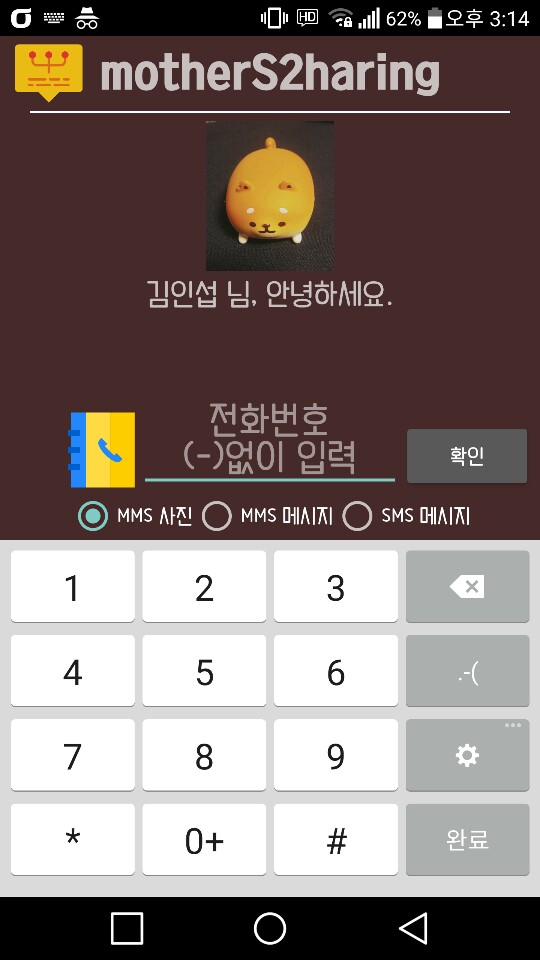

# 엄마 편하게 쓰시라고 만들어본  message sharing 
* 엄마가 문자로 온 몇 백장의 사진들을 카카오톡으로 공유하는 일이 필요하게 됐는데 사진을 일일이 다운로드 받아서 공유하는 것이 불편하다고 하여 만들어 봤습니다. SMS 텍스트, MMS 텍스트/사진을 탐색하여 외부로 한번에 공유할 수 있는 안드로이드 앱 입니다.

## 개발 환경
* Android Studio 3.0.1

## Kakao SDK (공부할 겸 한 번 사용해봄..실제 쓰이는 건 프로필 사진, 이름)
* Version : 1.16.0
* Use : usermgmt

## 필요한 권한
1. AndroidManifest.xml
```
  <!-- 문자 메시지 읽기 권한 -->
  <uses-permission android:name="android.permission.READ_SMS" />
  <!-- 인터넷 사용 권한 -->
  <uses-permission android:name="android.permission.INTERNET" />
  <!-- 외부 저장소 파일 읽기,생성 권한 -->
  <uses-permission android:name="android.permission.WRITE_EXTERNAL_STORAGE" />
```

## 주요 기능
1. AdapterListview
- sms 탐색
```
public void getSmsList() {
        try {
            Uri allMessage;
            Cursor cur;
            SmsItemData oItem;

            if(Build.MANUFACTURER.equals("samsung")) {
                allMessage = Uri.parse("content://sms/inbox");
                cur = cr.query(allMessage, null, null, null, null);               
            }else{
                allMessage = Uri.parse("content://sms/inbox");
                cur = cr.query(allMessage, null, "address=?", new String[]{phone}, null);
            }

            if (cur.moveToFirst()){
                all_cnt = cur.getCount();
                int cnt=0;
                Log.d(TAG, "SMS count = " + all_cnt);
                do{
                    cnt++;
                    String row = cur.getString(cur.getColumnIndex("address"));
                    String msg = cur.getString(cur.getColumnIndex("body"));
                    long long_date = cur.getLong(cur.getColumnIndex("date"));
                    String date = formatter.format(new Date(long_date));

                    if(Build.MANUFACTURER.equals("samsung")) {
                        if(row.equals(phone)) {
                            oItem = new SmsItemData(msg, date);
                            oItem.setStrMessage(msg);
                            oItem.setStrDate(date);
                            smsData.add(oItem);
                        }
                    }else{
                        oItem = new SmsItemData(msg, date);
                        oItem.setStrMessage(msg);
                        oItem.setStrDate(date);
                        smsData.add(oItem);
                    }
                    Log.d(TAG, "SMS Phone: " + row + " / Mesg: " + msg +" / Date: " + date);
                    complet_cnt=cnt;
                }
                while (cur.moveToNext()) ;
            }
            cur.close();
        } catch (Exception e) {
            e.printStackTrace();
        }
    }
```
- 전화번호 탐색
```
public String getMmsPhoneNumber(String id){
        String uriStr = MessageFormat.format("content://mms/{0}/addr", id);

        Uri phoneNumUri = Uri.parse(uriStr);
        Cursor cur = cr.query(phoneNumUri , null, "msg_id=?", new String[]{id}, null);
        String phoneNumber = null;

        if(cur.moveToFirst()){
            do {

                String address = cur.getString(cur.getColumnIndexOrThrow("address"));
                Log.d(TAG,"adress = " + address);
                if (address != null) {
                    phoneNumber = address.replace("-", "");
                }
            } while (cur.moveToNext());
        }
        cur.close();
        return phoneNumber;
    }
```
- 이미지 저장
```
private void SaveBitmapToFileCache(Bitmap bitmap, String path, String id) {

        // First Create Directory
        File dir = new File(path);
        Boolean dirExist = dir.exists();
        if(!dirExist){ dirExist = dir.mkdir(); }
        if(dirExist) {
            File outputFile = new File(path, phone + "_" + id + ".png");
            FileOutputStream out = null;

            try {
                //outputFile.createNewFile();
                out = new FileOutputStream(outputFile);
                bitmap.compress(Bitmap.CompressFormat.PNG, 100, out);
                out.flush();
                out.close();
            } catch (Exception e) {
                e.printStackTrace();
            }
        }
    }
```
- 이미지 불러오기
```
private Bitmap getMmsImage(String _id) {
        Uri partURI = Uri.parse("content://mms/part/" + _id);
        InputStream is = null;
        Bitmap bitmap = null;
        try {
            is = getContentResolver().openInputStream(partURI);
            bitmap = BitmapFactory.decodeStream(is);
        } catch (IOException e) { Log.d(TAG,"bitmap getmmsimage error",e); }
        finally {
            if (is != null) {
                try {
                    is.close();
                } catch (IOException e) { Log.d(TAG,"bitmap getmmsimage error",e); }
            }
        }
        return bitmap;
    }
```
- 이미지 공유
```
public void startShareIntent() {
        SparseBooleanArray boolArr = listview.getCheckedItemPositions();
        String path = Environment.getExternalStoragePublicDirectory(Environment.DIRECTORY_PICTURES) + File.separator + "mother";
        File directory;
        ArrayList<Uri> files = new ArrayList<>();

        for(int i=0;i<listview.getCheckedItemCount();i++) {
            if(boolArr.get(i)){
                directory = new File(path,phone+"_"+mmsData.get(i).getId()+".png");
                // generate URI, I defined authority as the application ID in the Manifest, the last param is file I want to open
                files.add( FileProvider.getUriForFile(this, BuildConfig.APPLICATION_ID, directory) );
            }
        }

        final Intent shareIntent = new Intent(Intent.ACTION_SEND_MULTIPLE);
        // set flag to give temporary permission to external app to use your FileProvider
        shareIntent.setFlags(Intent.FLAG_GRANT_READ_URI_PERMISSION);
        shareIntent.putExtra(Intent.EXTRA_STREAM, files);

        shareIntent.setType("image/*");

        // validate that the device can open your File!
        PackageManager pm = getApplicationContext().getPackageManager();
        if (shareIntent.resolveActivity(pm) != null) {
            startActivity(shareIntent);
        }
    }
```

## 실행 화면
1. 메인



2. MMS 사진 검색 결과


3. SMS 텍스트 검색 결과


4. MMS 사진 공유 결과


